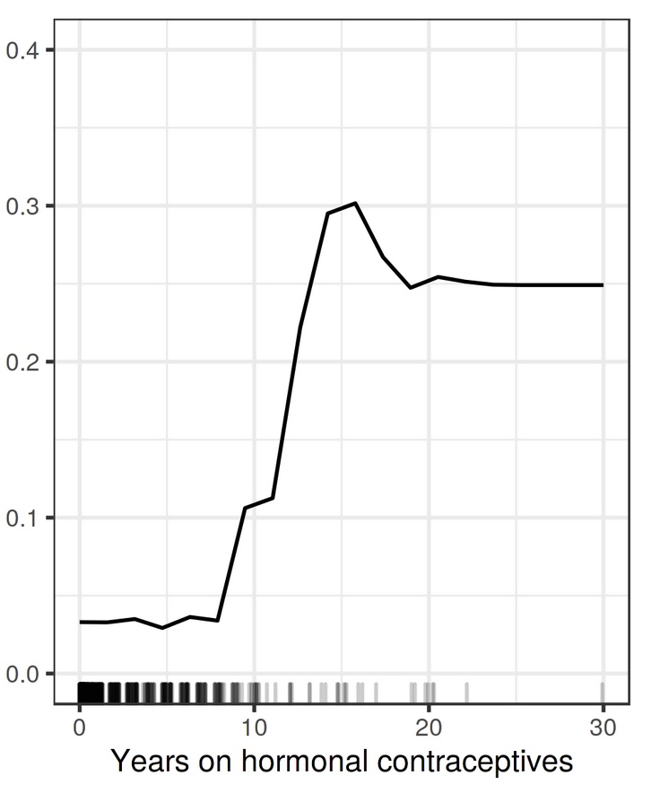
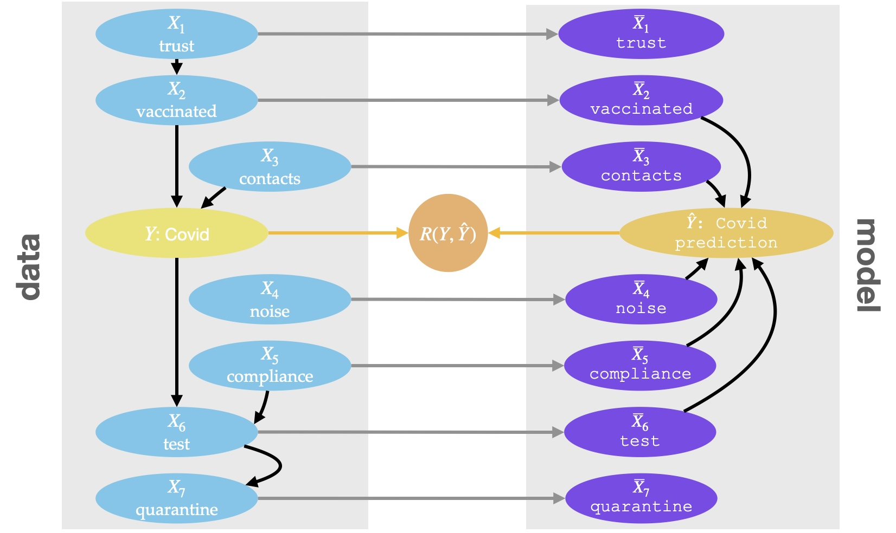

# Introduction

The goal of Interpretable Machine Learning (IML) is to provide human-intelligible descriptions of potentially complex ML models. However, IML descriptors themselves can be difficult to interpret: To reduce complexity, each method is limited to provide insight into *a specific aspect* of model and data. If the method's focus is not clearly understood, IML descriptors can be misinterpreted.

We illustrate the problem on a simple example: Suppose a practitioner aims to learn about the relevance of *in-store temperature* for *sales* at a petrol station. Therefore she fits a model on a sales dataset and computes the Partial Dependence Plot (PDP) for the temperature (Figure 1). 

Looking at the PDP output, she decides to turn up the theromstat in order to increase the sales. Her conclusion is not valid: In reality, increasing in-store temperature has a small negative causal effect on the sales.[^1] The reason is that the chosen method, PDP, is designed to provide insight into the model's mechanism, but in general does not allow insight into the effect of real-world actions.[^2]

In this article, we aid practicitioners to chose suitable IML tools and to avoid misinterpretation of the IML descriptor. More specifically, we guide practitioners to

1. carefully choose the aspect of model and data that shall be described
2. to understand which IML descriptors are suitable for their task. 

Therefore we present a taxonomy of the different aspects of model and data that may be of interest ([here]()) and classify existing established model-agnostic IML methods within that taxonomy ([here]()). [^3]

[^1]: The learned model includes both the temperature in-store and the temperature back-room. Both variables are strongly correlated; in the model they cancel each other out, such that they do not contribute to the prediction on real-world data. However, for the PDP the correlation between the variables is broken, such that the variable has an effect and we cannot make conclusions about the correlations in the data. Furthermore, correlation is not causation.

[^2]: Insight into the associations in the data is also not possible in this case. In fact there is only a very small association between in-store temperature and sales and it is negative (the PDP suggests the opposite).

[^3]: Our notation is as follows: We denote the optimal prediction model as $f^*$, the estimated model as $\hat{f}$. We suppose that the model was fitted on the covariates $X$ to predict $Y$. The model's prediction is denoted as $\hat{Y}$. Random variables are denoted with capital letters, the respective realizations as $X=x$ or just $x$.  Conditional dependence is denoted as $X \not \perp Y|Z$ (and independence as $X \perp Y |Z$). Probability distributions are denoted as $P(X)$, event probabilities as $p(x)$.  To denote causal interventions we make use of the $do$-operator: to indicate that variable $X_j$ is set to value $\theta_j$, we write $do(X_j=\theta_j)$. Furthermore, we assume that the data generating process can be described with a structural causal model (SCM) where the values of the variables are determined by the mutually independent exogenous variables $U_j$, the structural equations $f_j$ and the observation of the causal parents $X_{pa(j)}$, i.e. that  $X_j := f_j(X_{pa(j)}, U_j)$. The SCM induces a causal graph $\mathcal{G}$, where each node is connected with its direct effects with a directed edge. We assume that $\mathcal{G}$ is a directed acyclic graph (DAG).

# Which aspect of model and data shall be described?

As follows, we distinguish nine different aspects of model and data. Therefore, we distinguish IML descriptions along two questions:

1. Which object is described? Is it the model's prediction $\hat{Y}$, the underlying real-world object $Y$ or their relationship?
2. On what level is the object described? I.e., are we interested in observing co-occurance or in understanding causal effects? And, if we are interested in causal effects: Are we interested in the effect of plugging in different values into the model, or into the effect of actions in the real-world?

As follows, we demonstrate that the objects/levels of understanding are distinct and discuss when each of the categories may be of interest.

## Which object?

Depending on the interpretation goal, we may either be interested in understanding 

* the model's prediction $\hat{Y}$, 
* the prediction target $Y$,
* the prediction loss $L$, or more generally the relationship between $\hat{Y}$ and $Y$.

[TODO color code the bullets]

**Differentiation:** First of all, $Y$ and $\hat{Y}$ are different objects: In general they take different values within the observational distribution (since in general $Y$ cannot be perfectly predicted from the covariates). Furthermore they take different causal roles and as such behave very differently in interventional environments. For example, changing the test result has a causal effect on the Covid prediction, but does not affect whether someone is infected with covid. Clearly, $Y$ and $\hat{Y}$ are different objects than e.g. their loss $L$. For instance, the loss $L$ takes different values than $Y$ or $\hat{Y}$ and also has a different causal role.

**Suitability:** We have established that $Y$, $\hat{Y}$ and $R$ are different objects; the question which of the objects is of interest in which scenario remains. The practitioner has to carefully assess which of those is of interest in any situation; we cannot give general recommendations. However, we can roughly categorize as follows.
In scenarios where we trust the model and want to learn from it, e.g. in scientific inference, we typically aim to understand the underlying target $Y$. In these scenarios, the prediction is only a proxy for understanding $Y$.
In scenarios where we are sceptical of the model and the goal is to debug it, we typically aim to understand the prediction $\hat{Y}$. For instance, if the model relies on a protected attribute or a spuriously correlated variable, we would want to expose this, irrespective of whether that relationship is reflected in the underlying data generating process.
Understanding their relationship is for example interesting in situations where we want to understand the sensitivity of the model's performance to changes in the data generating process.

## On what level?

We have established that there are three distinct objects which all may be of interest depending on the situation. In this Section we explain that we can understand each of the objects on different levels. More specifically, we may either be interested in understanding

* How is the object associated with the covariates (statistical dependence)? [What does that mean exactly]
* How is the object affected by real-world action (i.e., interventions on light blue variables, $do(X_j=\theta_j)$)? [What does that mean why is it interesting]
* How is the object affected by model-level interventions (i.e., interventions on purple variables, $do(\overline{X}_j=\theta_j)$)? ][What does that mean why is it interesting?]

[TODO color code the bullets]

**Differentiation:** For instance, suppose that we are interested in the model's prediction. Data-level causation is different from model-level causation: For instance intervening on trust on the model level does not affect the prediction, but intervening on the data-level affects the prediction via the vaccination status. Furthermore causation is different from association: *quarantine* is associated with the prediction, but neither model-level intervention nor data-level intervention on *quarantine* affect the prediction.

*Subtitle: To illustrate our arguments, we make use of the example of a CoViD prediction model $\hat{f}$. The model is trained on variables such as the vaccination status or quick-test results and shall predict the risk of someone having covid. For the example we assume knowledge of the corresponding structural causal model (SCM), which we can use to sample data or to predict the effect of interventions in the real-world. The combination of model's mechanism and data generating process is illustrated below.*

**Suitability:** Describing objects with respect to the effects of data-level interventions is of interest if the description is meant to guide real-world interaction. For instance, recourse recommendations guide individuals towards reverting unfavorable decisions, or business analysists may be interested in understanding how to keep customers who are likely to churn. Estimating the effect of data-level interventions is in general difficult to obtain and not always necessary. For instance, to select the variables that are relevant to diagnose diseases understanding which variables are strongly associated with the disease is sufficient.
It has also been argued that, in order to understand the model's mechanism, we are interested in the effect of plugging in different values for each of the features to the model [cite janzing]. This allows for properties such as sensitivity, i.e. that nonzero effect implies nonzero coefficients. 

It remains an open question when which of the levels is of interest. Typically either data-level causation or association. Data-level causation tells us how the the object of interest behaves if we act in the real-world. Association is helpful if we are only interested in co-occurance (which is e.g. required for prediction). The use of model-level causation is debated; some argue that this is exactly what we want if we are interested in in interpretability since we want to understand the model's mechanism, others argue that interpretation of the model in unrealsitic regions is not helpful at all and that model-level interventions lead to extrapolation into unrealistic environments. 

# Classification of Common IML Techniques

Overview table with the 9 categories. 

|                          | prediction                   | target              | performance                        |
| ------------------------ | ---------------------------- | ------------------- | ---------------------------------- |
| **association**          | M-Plot conditional SHAP | -                   | conditional SAGE CFI ASV |
| **causal (data-level)**  | CR CSVs                 | MCR Hastie PDP | Invariant prediction importance    |
| **causal (model-level)** | CXplain marginal SHAP   | -                   | PFI marginal SAGE             |

# Relationships between categories

In principle mutually exclusive. 
Demonstrate on examples in one figure (e.g. respective global relevance plot for each type in a 3x3 grid), proof in appendix.

**approach 1:** assumptions and their consequences

* statistical independence of covariates
* causal independence of covariates
* observational identifiability of causal effect?
* bayes optimal predictor
* perfect predictor
  

**approach 2:** for each of the 9 classes, list which other classes imply the class and under which assumption they do so

e.g.: causal model-level prediction given ..., associative causal data-level prediction given 

# Use Cases and Application

## Example 1

Scientific model, trust in model, goal is knowledge generation; psychological dataset

* includes causes, effects, other variables

## Example 2

Decision model, trust in prior knowledge, goal is debugging; medical diagnosis

# Discussion

consequences for development of iml: not suitable for many questions?
- why interpret the data through a model?
- when is refitting more important

consequences for interpretation: many methods are applied incorrectly?

# Limitations

The taxonomy is not comprehensive. I.e. distinguish local/global, also does not include methods not fitting the focus (non tabular, model specific, surrogate models)

# Related Work

interpreting the model vs interpreting the data paper
janzing feature relevance quantification

# Conclusion

bli bla blub
